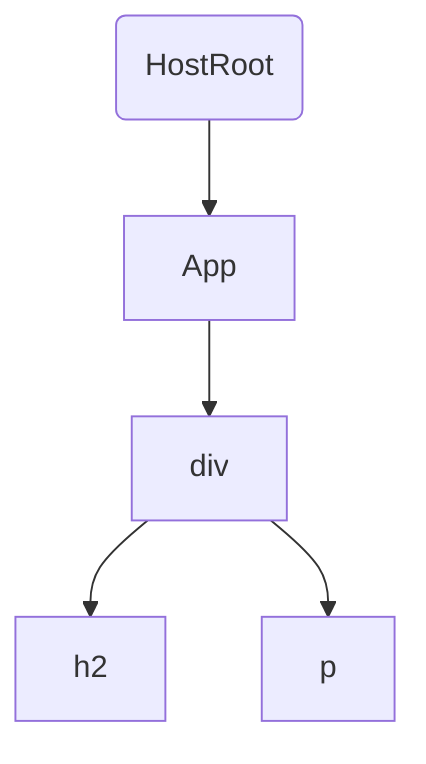

## DEMO

以下面 App 调试为例

```jsx
import React, {Component} from 'react';
import ReactDOM from 'react-dom';

class App extends Component {
  render() {
    return (
      <div>
        <h2>title 2</h2>
        <p>content p</p>
      </div>
    );
  }
}

const renderFinish = () => {
  console.log(222, 'renderFinish');
  
  const container = document.getElementById('root');
  
  console.log(333, container, container._reactRootContainer);
}

ReactDOM.render(<App />, document.getElementById('root'), renderFinish);
```

以该 Demo 来说，其 fiber 树如下所示：



在 render 过程中期处理顺序如下：

`beginWork(HostRoot)` —> `beginWork(App)` —> `beginWork(div)` —> `beginWork(h2)` —> `completeWork(h2)` —> `beginWork(p)` —> `completeWork(p)` —> `completeWork(div)` —> `completeWork(App)` —> `completeWork(HostRoot)`

## ReactDOM.render 入口

```js
// ReactDOM.render 调用的方法
function render(element, container, callback) {
  return legacyRenderSubtreeIntoContainer(null, element, container, false, callback);
}
```

render函数中参数 element，一般代表 React 的顶层 DOM


