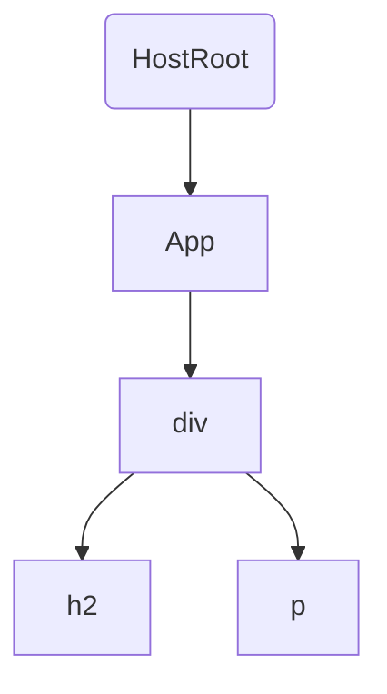

## DEMO

以下面 App 调试为例

```jsx
import React, {Component} from 'react';
import ReactDOM from 'react-dom';

class App extends Component {
  render() {
    return (
      <div>
        <h2>title 2</h2>
        <p>content p</p>
      </div>
    );
  }
}

const renderFinish = () => {
  console.log(222, 'renderFinish');
  
  const container = document.getElementById('root');
  
  console.log(333, container, container._reactRootContainer);
}

ReactDOM.render(<App />, document.getElementById('root'), renderFinish);
```

以该 Demo 来说，其 fiber 树如下所示：



在 render 过程中期处理顺序如下：

`beginWork(HostRoot)` —> `beginWork(App)` —> `beginWork(div)` —> `beginWork(h2)` —> `completeWork(h2)` —> `beginWork(p)` —> `completeWork(p)` —> `completeWork(div)` —> `completeWork(App)` —> `completeWork(HostRoot)`

## `ReactDOM.render` 入口

```js
// ReactDOM.render 调用的方法
function render(element, container, callback) {
  return legacyRenderSubtreeIntoContainer(null, element, container, false, callback);
}
```

render 函数中的参数 element，代表 React 的顶层 DOM


render 函数中参数 container，即为 `document.getElementById('root')` 获取的挂载对象


render 函数中参数 callback，代表 render 结束后执行的回调函数


## `legacyRenderSubtreeIntoContainer`

- 第一次渲染， root 不存在，所以需要调用 `legacyCreateRootFromDOMContainer` 创建 root。
- 创建完 Root 后调用 `updateContainer` 进入调度更新

```javascript
function legacyRenderSubtreeIntoContainer(parentComponent, children, container, forceHydrate, callback) {
  if (!root) {
    // Initial mount 第一次进入 root 不存在，只能先创建 root
    root = container._reactRootContainer = legacyCreateRootFromDOMContainer(container, forceHydrate);
    fiberRoot = root._internalRoot;

    // 对 ReactDOM.render 传入的回调函数进行一次封装
    if (typeof callback === 'function') {
      var originalCallback = callback;

      callback = function () {
        var instance = getPublicRootInstance(fiberRoot);
        originalCallback.call(instance);
      };
    } // Initial mount should not be batched.

    // 不适用批量更新，也就是马上将第一次更新结果渲染出来
    unbatchedUpdates(function () {
      updateContainer(children, fiberRoot, parentComponent, callback);
    });
  }
}
```

## `createFiberRoot` 创建Root、fiber

`legacyCreateRootFromDOMContainer` 经过层层调用最终进入到 `createFiberRoot` 函数内部
该函数创建了 `FiberRoot` 和 `RootFiber`

```javascript
function createFiberRoot(containerInfo, tag, hydrate, hydrationCallbacks) {
  // 创建 FiberRoot
  var root = new FiberRootNode(containerInfo, tag, hydrate);

  // 创建 RootFiber
  var uninitializedFiber = createHostRootFiber(tag);

  // 将 FiberRoot 和 RootFiber 关联起来
  root.current = uninitializedFiber;
  uninitializedFiber.stateNode = root;

  // 初始化 UpdateQueue
  initializeUpdateQueue(uninitializedFiber);
  return root;
}
```

创建的 `FiberRoot`


其中 `FiberRoot` 中的 tag 代表 RootTag 的类型：
``` javascript title="三种模式对应的Root类型"
export type RootTag = 0 | 1 | 2;

export const LegacyRoot = 0;
export const BlockingRoot = 1;
export const ConcurrentRoot = 2;
```

创建的 `RootFiber`


其中 `RootFiber` 中的 tag 代表该 fiber 的类型，在该 `RootFiber` 中，`fiber.tag = 3`，代表该 fiber 是该 fiber 树的根节点，一个 fiber 树只能有一个根节点：
``` javascript title="不同 fiber 对应的类型"
export const FunctionComponent = 0;
export const ClassComponent = 1;
export const IndeterminateComponent = 2; // Before we know whether it is function or class
export const HostRoot = 3; // Root of a host tree. Could be nested inside another node.
export const HostPortal = 4; // A subtree. Could be an entry point to a different renderer.
export const HostComponent = 5;
export const HostText = 6;
export const Fragment = 7;
export const Mode = 8;
export const ContextConsumer = 9;
export const ContextProvider = 10;
export const ForwardRef = 11;
export const Profiler = 12;
export const SuspenseComponent = 13;
export const MemoComponent = 14;
export const SimpleMemoComponent = 15;
export const LazyComponent = 16;
export const IncompleteClassComponent = 17;
export const DehydratedFragment = 18;
export const SuspenseListComponent = 19;
export const FundamentalComponent = 20;
export const ScopeComponent = 21;
export const Block = 22;
```

`fiber.mode = 0`，代表这个 Root 是 legacy 模式：
``` javascript title="TypeOfMode"
export type TypeOfMode = number;

export const NoMode = 0b0000;
export const StrictMode = 0b0001; // 1
export const BlockingMode = 0b0010; // 2
export const ConcurrentMode = 0b0100; // 4
export const ProfileMode = 0b1000; // 8
```

## `unbatchedUpdates` 不批量更新

`executionContext` 代表当期执行上下文，为 `0` 说明没有任务执行，不同的任务有不同的 `context` 类型， `fn(a)` 代表刚才传入的 `updateContainer(children, fiberRoot, parentComponent, callback)`


``` javascript title="几种 Context"
const NoContext = /*                    */ 0b000000; // 0
const BatchedContext = /*               */ 0b000001; // 1
const EventContext = /*                 */ 0b000010; // 2
const DiscreteEventContext = /*         */ 0b000100; // 4
const LegacyUnbatchedContext = /*       */ 0b001000; // 8
const RenderContext = /*                */ 0b010000; // 16
const CommitContext = /*                */ 0b100000; // 32
```

## `updateContainer` 开始更新

- 计算 `expirationTime`
- 创建 `update`，并把 `update` 挂载到对应的 `updateQueue` 上
- 调用 `scheduleWork` 开始调度更新

```javascript
function updateContainer(element, container, parentComponent, callback) {
  var current$1 = container.current;

  // 计算当前时间，用来给后边计算 expirationTime 使用
  // 但是因为是第一次渲染，所以优先级比较高，用不上这里计算的当前时间
  var currentTime = requestCurrentTimeForUpdate();
  var suspenseConfig = requestCurrentSuspenseConfig();

  // 因为是第一次更新，所以直接返回最高优先级时间，即 1073741823
  var expirationTime = computeExpirationForFiber(currentTime, current$1, suspenseConfig);

  // 创建一个 update，主要为了放在 fiber.updateQueue 上
  var update = createUpdate(expirationTime, suspenseConfig); 
  // Caution: React DevTools currently depends on this property
  // being called "element".

  // 把顶层 jsx 对象放在 update 对象的 payload 上，代表此次更新是一次从头开始的更新
  update.payload = {
    element: element
  };

  callback = callback === undefined ? null : callback;

  // 这里就是之前经过封装的 render 之后的回调函数=\
  if (callback !== null) {
    update.callback = callback;
  }
  
  // 把 update 对象放在 fiber.updateQueue 上
  enqueueUpdate(current$1, update);

  // 开始调度更新任务
  scheduleWork(current$1, expirationTime);
  return expirationTime;
}
```

如下图所示，主要是给 `fiber.updateQueue` 挂载了一个 `update` 对象，并计算出了 `expirationTime`


## `scheduleWork` 开始调度

- 把子 fiber 的更新时间反映到 Root 上，以便更方便知道一个 fiber 树是否需要更新
- 调用 `performSyncWorkOnRoot` 开始更新

```javascript
function scheduleUpdateOnFiber(fiber, expirationTime) {
  // 把 fiber.updateQueue 里的 expirationTime 提到外层
  // 最终 root.firstPendingTime = fiber.expirationTime = expirationTime;
  var root = markUpdateTimeFromFiberToRoot(fiber, expirationTime);

  // 默认是一个 Normal 的优先级，97
  var priorityLevel = getCurrentPriorityLevel();

  // 此时 expirationTime = Sync = 1073741823，会进入该 if 判断
  if (expirationTime === Sync) {
    if ( // Check if we're inside unbatchedUpdates，此时本来就处于 unbatchedUpdates 上下文中
    (executionContext & LegacyUnbatchedContext) !== NoContext && // Check if we're not already rendering
    (executionContext & (RenderContext | CommitContext)) === NoContext) {
      // 开始调度更新
      performSyncWorkOnRoot(root);
    } 
  }
}

// scheduleWork 最终调用 scheduleUpdateOnFiber 方法。
var scheduleWork = scheduleUpdateOnFiber; // This is split into a separate function so we can mark a fiber with pending
```

`root.firstPendingTime` 挂载了优先级最高的更新时间


`fiber.expirationTime` 也挂载了当前 fiber 最高优先级的更新时间


## `performSyncWorkOnRoot` 同步更新

主要分为两个阶段，一个是 `render` 阶段，一个是 `commit` 阶段，也可以说该函数就是开始调度更新的入口。

该函数主要作用是调用 `workLoopSync` 对 root 节点进行循环处理。

```javascript
function performSyncWorkOnRoot(root) {
  // Check if there's expired work on this root. Otherwise, render at Sync.
  var lastExpiredTime = root.lastExpiredTime;
  var expirationTime = lastExpiredTime !== NoWork ? lastExpiredTime : Sync;

  // 此时 root 和 expirationTime 存在
  // workInProgressRoot 和 renderExpirationTime 都不存在，所以条件成立，进入 if 判断
  if (root !== workInProgressRoot || expirationTime !== renderExpirationTime$1) {
    // 准备一个 workInProgress 树，将当前 current 上的属性都赋值给 workInProgress 树
    prepareFreshStack(root, expirationTime);
  } // If we have a work-in-progress fiber, it means there's still work to do
  // in this root.

  // 经过 prepareFreshStack 函数处理，workInProgress 树已存在
  if (workInProgress !== null) {
    var prevExecutionContext = executionContext; // 8

    // RenderContext = 16，所以 executionContext = 24
    executionContext |= RenderContext; 

    do {
      try {
        // 循环同步处理
        workLoopSync();
        break;
      } catch (thrownValue) {
        handleError(root, thrownValue);
      }
    } while (true);

    executionContext = prevExecutionContext;

    // root.current 代表 RootFiber，它对应的 alternate 代表 RootFiber 对应的 workInProgress
    // 当 render 过程结束后把 RootFiber 对应的 workInProgress 挂载在 root.finishedWork 上
    root.finishedWork = root.current.alternate;
    root.finishedExpirationTime = expirationTime;

    // 结束同步 render 过程，也要开启 commit 过程
    finishSyncRender(root);

    ensureRootIsScheduled(root);
  }

  return null;
}
```

## `prepareFreshStack`

给 `RootFiber` 初始化一个 `workInProgress`

```javascript
function prepareFreshStack(root, expirationTime) {
  root.finishedWork = null;
  root.finishedExpirationTime = NoWork;
  var timeoutHandle = root.timeoutHandle;

  // workInProgressRoot 是全局对象，保存当前更新的 root 树
  workInProgressRoot = root;

  // 把 root.current 复制一份给 workInProgress，两者通过 alertnate 相连
  workInProgress = createWorkInProgress(root.current, null);
  renderExpirationTime$1 = expirationTime;
  workInProgressRootExitStatus = RootIncomplete;
  workInProgressRootFatalError = null;
  workInProgressRootLatestProcessedExpirationTime = Sync;
  workInProgressRootLatestSuspenseTimeout = Sync;
  workInProgressRootCanSuspendUsingConfig = null;
  workInProgressRootNextUnprocessedUpdateTime = NoWork;
  workInProgressRootHasPendingPing = false;
}
```

- `current.alternate = workInProgress`
- `workInProgress.alternate = current`


## `workLoopSync` 循环处理 fiber

此时的 `workInProgress` 还是刚才初始化的 `workInProgress`

```javascript
function workLoopSync() {
  // Already timed out, so perform work without checking if we need to yield.
  // 循环处理每一个 fiber
  while (workInProgress !== null) {
    workInProgress = performUnitOfWork(workInProgress);
  }
}
```

`workInProgress` 先后执行顺序为：`HostRoot —> App —> div —> h2 —> p`

## 处理不同类型组件

- [开始处理HostRoot](开始处理HostRoot)
- [开始处理AppComponent](开始处理AppComponent)
- [开始处理原生DOM](开始处理原生DOM)

## `finishSyncRender` 开始 Commit

 - 清空 `workInProgressRoot`
 - 调用 `commitRoot` 开启 commit 阶段

```javascript
function finishSyncRender(root) {
  // Set this to null to indicate there's no in-progress render.
  workInProgressRoot = null;
  commitRoot(root);
}
```

## `commitRootImpl`

commit 阶段主要是三个循环处理：
- 调用 `commitBeforeMutationEffects` 处理 DOM 更新前的操作
- 调用 `commitMutationEffects` 将实现 DOM 挂载
- 调用 `commitLayoutEffects` 处理 DOM 更新后的副作用

```javascript
function commitRootImpl(root, renderPriorityLevel) {
  if (firstEffect !== null) {
    nextEffect = firstEffect;

    do {
      {
        invokeGuardedCallback(null, commitBeforeMutationEffects, null);
      }
    } while (nextEffect !== null);

    nextEffect = firstEffect;

    do {
      {
        invokeGuardedCallback(null, commitMutationEffects, null, root, renderPriorityLevel);
      }
    } while (nextEffect !== null);

    root.current = finishedWork; // The next phase is the layout phase, where we call effects that read
    nextEffect = firstEffect;

    do {
      {
        invokeGuardedCallback(null, commitLayoutEffects, null, root, expirationTime);
      }
    } while (nextEffect !== null);

    nextEffect = null; // Tell Scheduler to yield at the end of the frame, so the browser has an

    requestPaint();
  }

  onCommitRoot(finishedWork.stateNode, expirationTime); // Always call this before exiting `commitRoot`, to ensure that any

  ensureRootIsScheduled(root);

  flushSyncCallbackQueue();
  return null;
}
```

## `commitBeforeMutationEffects` 更新前

该函数主要有两个功能：
 - 执行 `getSnapshotBeforeUpdate` 生命周期方法
 - 对 `useEffect` 进行调度，让 DOM 此次同步更新任务完成后可以调度执行 `useEffect` 中的回调函数

```javascript
function commitBeforeMutationEffects() {
  while (nextEffect !== null) {
    var effectTag = nextEffect.effectTag;

    if ((effectTag & Snapshot) !== NoEffect) {
      setCurrentFiber(nextEffect);
      recordEffect();
      var current = nextEffect.alternate;
      // 主要执行 getSnapshotBeforeUpdate 生命周期方法
      commitBeforeMutationLifeCycles(current, nextEffect);
      resetCurrentFiber();
    }

    if ((effectTag & Passive) !== NoEffect) {
      // If there are passive effects, schedule a callback to flush at
      // the earliest opportunity.
      if (!rootDoesHavePassiveEffects) {
        rootDoesHavePassiveEffects = true;
        scheduleCallback(NormalPriority, functiono () {
          // 调度 useEffect
          flushPassiveEffects();
          return null;
        });
      }
    }

    nextEffect = nextEffect.nextEffect;
  }
}
```

## `commitBeforeMutationLifeCycles`

只对 `ClassComponent` 进行处理，执行  `getSnapshotBeforeUpdate` 生命周期方法

```javascript
function commitBeforeMutationLifeCycles(
  current: Fiber | null,
  finishedWork: Fiber,
): void {
  switch (finishedWork.tag) {
    case FunctionComponent:
    case ForwardRef:
    case SimpleMemoComponent:
    case Block: {
      return;
    }
    case ClassComponent: {
      if (finishedWork.effectTag & Snapshot) {
        if (current !== null) {
          const prevProps = current.memoizedProps;
          const prevState = current.memoizedState;
          const instance = finishedWork.stateNode;
          // We could update instance props and state here,
          // but instead we rely on them being set during last render.
          // 调用 getSnapshotBeforeUpdate 方法，在该方法里可以拿到更新前的DOM
          const snapshot = instance.getSnapshotBeforeUpdate(
            finishedWork.elementType === finishedWork.type
              ? prevProps
              : resolveDefaultProps(finishedWork.type, prevProps),
            prevState,
          );
          instance.__reactInternalSnapshotBeforeUpdate = snapshot;
        }
      }
      return;
    }
    case HostRoot:
    case HostComponent:
    case HostText:
    case HostPortal:
    case IncompleteClassComponent:
      // Nothing to do for these component types
      return;
  }
}
```

## `flushPassiveEffects`

该函数经过 `scheduleCallback` 调度后，最终调用 `flushPassiveEffectsImpl` 函数

使用 `scheduleCallback` 调度，使得 `flushPassiveEffects` 可以异步执行jjjj。

```javascript
scheduleCallback(NormalPriority, function () {
  flushPassiveEffects();
  return null;
});

// 确定优先级，调度执行 flushPassiveEffectsImpl 函数
function flushPassiveEffects() {
  if (pendingPassiveEffectsRenderPriority !== NoPriority) {
    var priorityLevel = pendingPassiveEffectsRenderPriority > NormalPriority ? NormalPriority : pendingPassiveEffectsRenderPriority;
    pendingPassiveEffectsRenderPriority = NoPriority;
    return runWithPriority$1(priorityLevel, flushPassiveEffectsImpl);
  }
}
```

## `flushPassiveEffectsImpl`

`flushPassiveEffects` 最终调用 `flushPassiveEffectsImpl` 函数。

在 `flushPassiveEffectsImpl` 函数中，最终还是调用 `commitPassiveHookEffects` 函数

```javascript
function flushPassiveEffectsImpl() {
  {
    var _effect2 = root.current.firstEffect;

    while (_effect2 !== null) {
      {
        invokeGuardedCallback(null, commitPassiveHookEffects, null, _effect2);
      }

      var nextNextEffect = _effect2.nextEffect; // Remove nextEffect pointer to assist GC

      _effect2.nextEffect = null;
      _effect2 = nextNextEffect;
    }
  }

  return true;
}
```

## `commitPassiveHookEffects`

该函数内部主要针对 `FunctionComponent` 类型 fiber 执行两个函数：

 - `commitHookEffectListUnmount`：执行 `useEffect` 的销毁函数
 - `commitHookEffectListMount`：执行 `useEffect` 函数

可以看到在调用两个 `commit` 函数的时候都传入了 `Passive$1 | HasEffect`，这也决定了此处是对 `useEffect` 的处理，因为在初始化 `useEffect` 时，传入的就是 `PassiveEffect`，而初始化 `useLayoutEffect` 时传入的是 `HookLayout`。

```javascript
function commitPassiveHookEffects(finishedWork) {
  if ((finishedWork.effectTag & Passive) !== NoEffect) {
    switch (finishedWork.tag) {
      case FunctionComponent:
      case ForwardRef:
      case SimpleMemoComponent:
      case Block:
        {
          // TODO (#17945) We should call all passive destroy functions (for all fibers)
          // before calling any create functions. The current approach only serializes
          // these for a single fiber.
          commitHookEffectListUnmount(Passive$1 | HasEffect, finishedWork);
          commitHookEffectListMount(Passive$1 | HasEffect, finishedWork);
          break;
        }
    }
  }
}
```

## `commitHookEffectListUnmount`

执行 `useEffect` 对应的销毁函数。

```javascript
function commitHookEffectListUnmount(tag, finishedWork) {
  var updateQueue = finishedWork.updateQueue;
  var lastEffect = updateQueue !== null ? updateQueue.lastEffect : null;

  if (lastEffect !== null) {
    var firstEffect = lastEffect.next;
    var effect = firstEffect;

    do {
      if ((effect.tag & tag) === tag) {
        // Unmount
        var destroy = effect.destroy;
        effect.destroy = undefined;

        if (destroy !== undefined) {
          destroy();
        }
      }

      effect = effect.next;
    } while (effect !== firstEffect);
  }
}
```

## `commitHookEffectListMount`

执行 `useEffect` 钩子函数，因为 `flushPassiveEffects` 是通过 `scheduleCallback` 调度执行，所以这里的钩子函数也不是马上同步执行，而是等到本次更新任务完成后，浏览器有空闲时才会执行，这也是 `useEffect` 异步执行的原因。

由此可以得出 `useEffect` 的执行顺序在 `useLayoutEffect` 之后。

```javascript
function commitHookEffectListMount(tag, finishedWork) {
  var updateQueue = finishedWork.updateQueue;
  var lastEffect = updateQueue !== null ? updateQueue.lastEffect : null;

  if (lastEffect !== null) {
    var firstEffect = lastEffect.next;
    var effect = firstEffect;

    do {
      if ((effect.tag & tag) === tag) {
        // Mount
        var create = effect.create;
        effect.destroy = create();
      }

      effect = effect.next;
    } while (effect !== firstEffect);
  }
}
```

## `commitMutationEffects` 更新时

把调度阶段形成的真实 DOM 树挂载在 root 节点下。

```javascript
function commitMutationEffects(root, renderPriorityLevel) {
  while (nextEffect !== null) {
    var primaryEffectTag = effectTag & (Placement | Update | Deletion | Hydrating);

    switch (primaryEffectTag) {
      case Placement:
        {
          commitPlacement(nextEffect); 
          // Clear the "placement" from effect tag so that we know that this is
          // inserted, before any life-cycles like componentDidMount gets called.

          nextEffect.effectTag &= ~Placement;
          break;
        }
    } 

    nextEffect = nextEffect.nextEffect;
  }
}
```

## `commitPlacement`

找到 `parentFiber` ，执行 `insertOrAppendPlacementNodeIntoContainer` 将子树插入 `parentFiber` 中。

```javascript
function commitPlacement(finishedWork) {
  var parentFiber = getHostParentFiber(finishedWork);

  var parent;
  var isContainer;
  var parentStateNode = parentFiber.stateNode;

  switch (parentFiber.tag) {
    case HostRoot:
      parent = parentStateNode.containerInfo;
      isContainer = true;
      break;
  }

  var before = getHostSibling(finishedWork); // We only have the top Fiber that was inserted but we need to recurse down its
  // children to find all the terminal nodes.
  // true
  if (isContainer) {
    // 会进入此处
    insertOrAppendPlacementNodeIntoContainer(finishedWork, before, parent);
  } else {
    // todo
  }
}
```

## `insertOrAppendPlacementNodeIntoContainer`

此时参数如下：

- `node`：`App ClassComponent` 对应的 `fiber`
- `before`：`null`
- `parent`：`div.root`

```javascript
function insertOrAppendPlacementNodeIntoContainer(node, before, parent) {
  var tag = node.tag;
  var isHost = tag === HostComponent || tag === HostText;

  if (isHost || enableFundamentalAPI ) {
    var stateNode = isHost ? node.stateNode : node.stateNode.instance;

    if (before) {
      // 调用 insertBefore 把 stateNode 插入 before 节点之前
      insertInContainerBefore(parent, stateNode, before);
    } else {
      // 执行 appendChild 把根 DOM 节点插入 div.root 下
      appendChildToContainer(parent, stateNode);
    }
  } else if (tag === HostPortal) ; else {
    var child = node.child;

    if (child !== null) {
      // 递归调用自身
      insertOrAppendPlacementNodeIntoContainer(child, before, parent);
      var sibling = child.sibling;

      // 该循环是应对 App 下边顶层 DOM 是个列表的情况
      // 所以这才是 HostRoot 存在的意义，总要有个统一的收口
      while (sibling !== null) {
        insertOrAppendPlacementNodeIntoContainer(sibling, before, parent);
        sibling = sibling.sibling;
      }
    }
  }
}
```

## `commitLayoutEffects` 更新后

主要执行一些DOM更新后的生命周期以及回调函数

```javascript
function commitLayoutEffects(root, committedExpirationTime) {
  // TODO: Should probably move the bulk of this function to commitWork.
  while (nextEffect !== null) {
    var effectTag = nextEffect.effectTag;

    if (effectTag & (Update | Callback)) {
      var current = nextEffect.alternate;
      commitLifeCycles(root, current, nextEffect);
    }

    nextEffect = nextEffect.nextEffect;
  }
}
```

## `commitLifeCycles`

执行 DOM 提交后需要执行的生命周期，如： `componentDidMount`、`componentDidUpdate`、`useLayoutEffect`等

```javascript
function commitLifeCycles(finishedRoot, current, finishedWork, committedExpirationTime) {
  switch (finishedWork.tag) {
    case FunctionComponent:
    case ForwardRef:
    case SimpleMemoComponent:
    case Block: {
      // At this point layout effects have already been destroyed (during mutation phase).
      // This is done to prevent sibling component effects from interfering with each other,
      // e.g. a destroy function in one component should never override a ref set
      // by a create function in another component during the same commit.
      // 传入的是 HookLayout，说明这里会执行 useLayoutEffect 钩子
      commitHookEffectListMount(HookLayout | HookHasEffect, finishedWork);

      if (runAllPassiveEffectDestroysBeforeCreates) {
        schedulePassiveEffects(finishedWork);
      }
      return;
    }
    case ClassComponent:
      {
        var instance = finishedWork.stateNode;

        if (finishedWork.effectTag & Update) {
          if (current === null) {
            // but instead we rely on them being set during last render.
            // TODO: revisit this when we implement resuming.

            // current 不存在，说明是第一次渲染，执行 componentDidMount
            instance.componentDidMount();
            stopPhaseTimer();
          } else {
            var prevProps = finishedWork.elementType === finishedWork.type ? current.memoizedProps : resolveDefaultProps(finishedWork.type, current.memoizedProps);
            var prevState = current.memoizedState;
            // but instead we rely on them being set during last render.
            // TODO: revisit this when we implement resuming.

            // current存在，说明是组件更新，执行 componentDidUpdate
            instance.componentDidUpdate(prevProps, prevState, instance.__reactInternalSnapshotBeforeUpdate);
            stopPhaseTimer();
          }
        }

        var updateQueue = finishedWork.updateQueue;

        if (updateQueue !== null) {
          // but instead we rely on them being set during last render.
          // TODO: revisit this when we implement resuming.

          // 执行更新后的一些回调函数，如setState的回调等
          commitUpdateQueue(finishedWork, updateQueue, instance);
        }

        return;
      }

    case HostRoot:
      {
        var _updateQueue = finishedWork.updateQueue;

        if (_updateQueue !== null) {
          var _instance = null;

          if (finishedWork.child !== null) {
            switch (finishedWork.child.tag) {
              case HostComponent:
                _instance = getPublicInstance(finishedWork.child.stateNode);
                break;

              case ClassComponent:
                _instance = finishedWork.child.stateNode;
                break;
            }
          }

          // 执行 ReactDOM.render 的回调方法
          commitUpdateQueue(finishedWork, _updateQueue, _instance);
        }

        return;
      }

    case HostComponent:
      {
        var _instance2 = finishedWork.stateNode; // Renderers may schedule work to be done after host components are mounted
        // (eg DOM renderer may schedule auto-focus for inputs and form controls).
        // These effects should only be committed when components are first mounted,
        // aka when there is no current/alternate.

        if (current === null && finishedWork.effectTag & Update) {
          var type = finishedWork.type;
          var props = finishedWork.memoizedProps;
          commitMount(_instance2, type, props);
        }

        return;
      }
}
```

## `commitUpdateQueue`

主要执行该 fiber 上保存的回调函数，如果是 `HostRoot`，则执行的是 `ReactDOM.render` 函数的回调函数，如果是 `ClassComponent` 则执行的是 `this.setState` 的回调函数。

```javascript
export function commitUpdateQueue<State>(
  finishedWork: Fiber,
  finishedQueue: UpdateQueue<State>,
  instance: any,
): void {
  // Commit the effects
  const effects = finishedQueue.effects;
  finishedQueue.effects = null;
  if (effects !== null) {
    for (let i = 0; i < effects.length; i++) {
      const effect = effects[i];
      const callback = effect.callback;
      if (callback !== null) {
        effect.callback = null;
        callCallback(callback, instance);
      }
    }
  }
}
```

## `commitMount`

判断如果是原生 DOM 且需要自动 focus 时就执行 `focus` 方法。

```javascript
export function commitMount(
  domElement: Instance,
  type: string,
  newProps: Props,
  internalInstanceHandle: Object,
): void {
  // Despite the naming that might imply otherwise, this method only
  // fires if there is an `Update` effect scheduled during mounting.
  // This happens if `finalizeInitialChildren` returns `true` (which it
  // does to implement the `autoFocus` attribute on the client). But
  // there are also other cases when this might happen (such as patching
  // up text content during hydration mismatch). So we'll check this again.
  if (shouldAutoFocusHostComponent(type, newProps)) {
    ((domElement: any):
      | HTMLButtonElement
      | HTMLInputElement
      | HTMLSelectElement
      | HTMLTextAreaElement).focus();
  }
}
```
